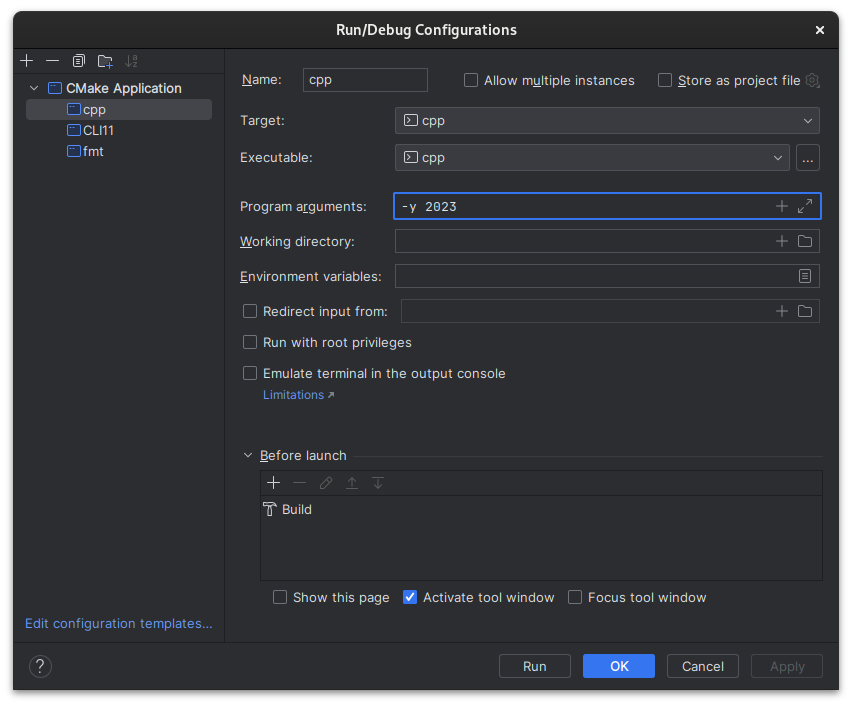

# cpp
> [!NOTE]
> [Advent of Code](https://adventofcode.com/) is an Advent calendar of small programming puzzles for a variety of skill sets and skill levels that can be solved in any programming language you like. People use them as interview prep, company training, university coursework, practice problems, a speed contest, or to challenge each other.

## Running
> [!IMPORTANT]  
> If you have any doubts about the CLI flags, run with `./cpp -h`

You can run the program through the terminal by going to the folder where it was compiled and running `./cpp` or using your IDE run/debug configurations.

Flags can also be added to IDE, as in the example below:
